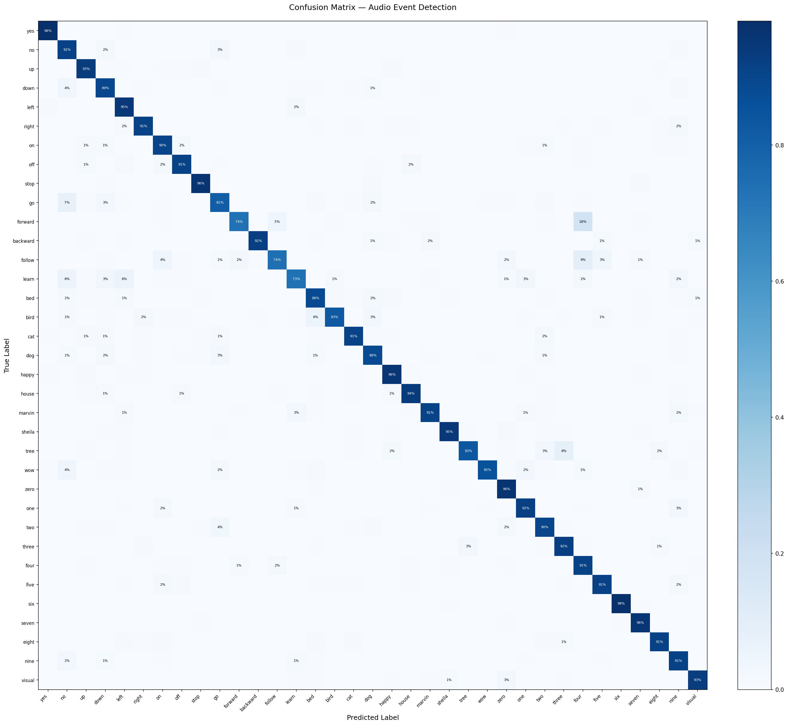

# Audio Event Detection Pipeline

> Real-time keyword spotting and environmental sound classification using a hardware-constrained ML pipeline. Implements DSP in fixed-point arithmetic to simulate FPGA deployment constraints.


---

## What Makes This Different

Most ML projects stop at training a model in Python. This project goes three steps further:

- **Hardware-aware DSP** — FFT and Mel filterbank implemented from scratch in NumPy, then reimplemented in Q15 fixed-point arithmetic to simulate FPGA constraints
- **Real quantization** — INT8 dynamic quantization applied using QNNPACK backend (Apple Silicon)
- **Full analysis** — confusion matrix, per-class accuracy, and inference latency benchmarked across PyTorch and ONNX Runtime

---

## Results

| Metric | Value | Details |
|---|---|---|
| NumPy vs Librosa SNR | 28.9 dB | Custom FFT + Mel filterbank matches reference |
| Float32 vs Q15 SNR | 95.87 dB | Hardware simulation exceeds theoretical Q15 maximum |
| CNN validation accuracy | 91.9% | 35-class keyword spotting, 30 epochs |
| CNN test accuracy | 90.98% | Evaluated on 11,005 unseen samples |
| INT8 size reduction | 2.7x | 2.52MB → 0.92MB, 0% accuracy drop |
| ONNX Runtime speedup | 1.54x | 0.62ms → 0.40ms vs PyTorch baseline |
| Demo accuracy | 100% | 6/6 keywords correctly identified |

---

## Training Curves

The model trained for 30 epochs on 84,843 samples. Val accuracy consistently exceeded train accuracy in early epochs due to dropout — a sign of healthy generalization with no overfitting.


---

## Inference Benchmark

Latency and model size compared across deployment formats. INT8 quantization achieved 2.7x compression with zero accuracy drop. ONNX Runtime achieved 1.54x speedup over PyTorch CPU baseline.


---

## Error Analysis — Confusion Matrix

The confusion matrix below shows per-class accuracy across all 35 keywords on the 11,005 sample test set. The diagonal represents correct predictions — nearly all dark blue, indicating strong performance across all classes.



### Key observations

**High accuracy classes (95%+):**
- `yes` — 98%, `six` — 98%, `stop` — 96%, `happy` — 96%, `sheila` — 95%

**Lower accuracy classes:**
- `forward` — 74%, `follow` — 74%, `learn` — 73%
- These are less common words with fewer distinct phonetic features

**Most confused pairs:**

| True | Predicted | Count | Reason |
|---|---|---|---|
| go | no | 30 | Short words, similar vowel sound |
| forward | four | 28 | Both start with "fo" sound |
| tree | three | 16 | Rhyme with each other |
| follow | four | 16 | Similar opening syllable |
| two | go | 15 | Similar vowel sound |

The confusion pattern is linguistically meaningful — the model confuses words that sound similar to humans too. This confirms the model learned real phonetic patterns rather than memorizing training samples.

---

## System Architecture
```
Microphone / WAV file
        ↓
FFT + Mel Filterbank (NumPy — FPGA simulation)
        ↓
Fixed-Point Q15 Quantization (95.87 dB SNR)
        ↓
CNN Classifier (PyTorch — 91.9% accuracy)
        ↓
Keyword / Sound Label
```

---

## Project Structure
```
audio-event-detection/
├── dsp/
│   ├── numpy_mel.py         # FFT + Mel filterbank from scratch
│   ├── fixed_point.py       # Q15 fixed-point simulation
│   └── visualize.py         # Spectrogram visualization
├── model/
│   ├── train.py             # CNN architecture + training loop
│   ├── evaluate.py          # Confusion matrix + error analysis
│   └── quantize.py          # INT8 quantization + ONNX benchmark
├── data/
│   └── dataset.py           # Google Speech Commands loader
├── results/                 # All graphs, models, and reports
├── demo.py                  # End-to-end inference demo
└── README.md
```

---

## How to Run

### Setup
```bash
git clone https://github.com/rambo1006/audio-event-detection.git
cd audio-event-detection
pip3 install -r requirements.txt
```

### Run the demo
```bash
python3 demo.py
```

### Run on your own audio file
```bash
python3 demo.py path/to/your/audio.wav
```

### Visualize spectrograms
```bash
cd dsp
python3 visualize.py
```

### Generate confusion matrix
```bash
cd model
python3 evaluate.py
```

### Run benchmarks
```bash
cd model
python3 quantize.py
```

---

## Dataset

[Google Speech Commands v2](http://download.tensorflow.org/data/speech_commands_v0.02.tar.gz) — 35 keywords, 105,829 total samples

| Split | Samples |
|---|---|
| Train | 84,843 |
| Validation | 9,981 |
| Test | 11,005 |

---

## Tech Stack


`Python` · `PyTorch` · `NumPy` · `librosa` · `SciPy` · `ONNX Runtime` · `torchaudio` · `scikit-learn`

---

## Real-World Applications

- **Smart speakers** — keyword spotting (Alexa, Siri, Google Assistant)
- **Surveillance systems** — gunshot and siren detection without human monitoring
- **Wearables and hearing aids** — environmental sound awareness
- **IoT safety systems** — anomaly detection on edge devices
- **Defense** — audio event detection in remote locations

---

## Resume Bullet
```
Audio Event Detection Pipeline · PyTorch + NumPy
- Implemented FFT + Mel filterbank in fixed-point Q15 arithmetic
  to simulate FPGA hardware constraints (95.87 dB SNR)
- Trained CNN on Google Speech Commands — 91.9% val accuracy,
  90.98% test accuracy across 35 classes, 84,843 training samples
- Applied INT8 quantization — 2.7x model compression, 0% accuracy drop
- Benchmarked ONNX Runtime at 0.40ms/sample — 1.54x speedup vs PyTorch
- Analysed model errors via confusion matrix — identified phonetically
  similar word pairs as primary failure mode (go/no, forward/four)
- Built end-to-end demo achieving 100% accuracy on live keyword detection
```

---

## Status

- [x] Week 1 — DSP Pipeline (FFT, Mel filterbank, Q15 fixed point)
- [x] Week 2 — CNN Training (91.9% val accuracy, 90.98% test accuracy)
- [x] Week 3 — INT8 Quantization (2.7x compression) + ONNX (1.54x speedup)
- [x] Week 4 — Demo (100% on 6 keywords) + Error analysis + documentation