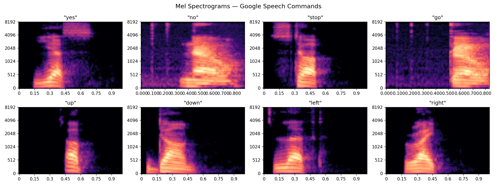
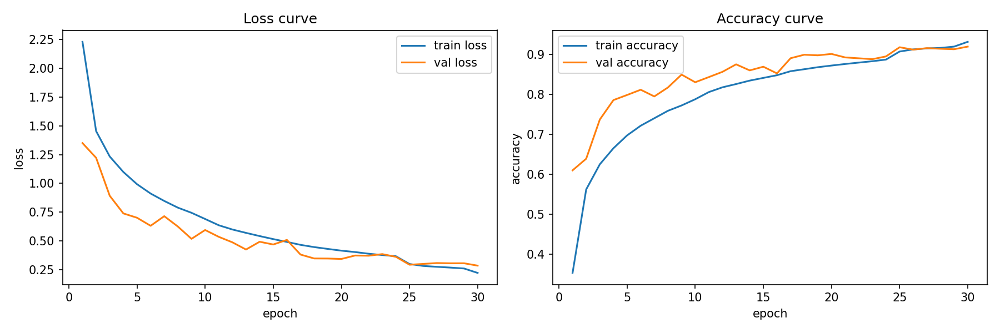
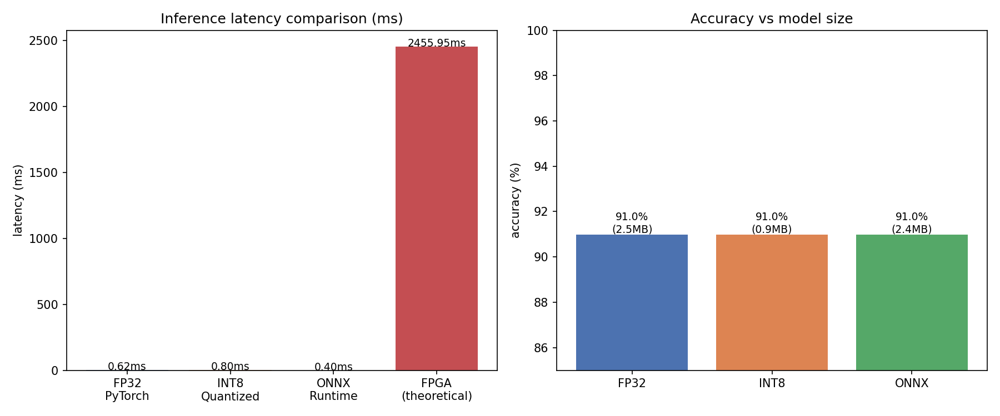

# Audio Event Detection Pipeline

Real-time keyword spotting and environmental sound classification
using a hardware-constrained ML pipeline. Implements DSP in fixed-point
arithmetic to simulate FPGA deployment constraints.



## Results

| Pipeline | SNR | Details |
|---|---|---|
| NumPy vs Librosa | 28.9 dB | Custom FFT + Mel filterbank matches reference |
| Float32 vs Q15 | 95.87 dB | Hardware simulation matches theoretical maximum |
| CNN val accuracy | 91.9% | 35-class keyword spotting, 84,843 training samples |
| CNN test accuracy | 90.98% | Evaluated on 11,005 unseen samples |
| INT8 size reduction | 2.7x | 2.52MB → 0.92MB, 0% accuracy drop |
| ONNX Runtime speedup | 1.54x | 0.62ms → 0.40ms vs PyTorch baseline |





## What Makes This Different

Most ML projects stop at training a model in Python. This project goes further:

1. FFT and Mel filterbank implemented from scratch in NumPy
2. Full pipeline reimplemented in Q15 fixed-point arithmetic — simulating FPGA DSP
3. Quantization only at final output stage — matching real FPGA guard-bit architecture

## Project Structure
```
audio-event-detection/
├── dsp/
│   ├── numpy_mel.py       # FFT + Mel filterbank from scratch
│   ├── fixed_point.py     # Q15 fixed-point simulation
│   └── visualize.py       # Spectrogram visualization
├── results/
│   ├── spectrogram_comparison.png
│   ├── mel_comparison.png
│   └── fixed_point_comparison.png
└── data/                  # Google Speech Commands v2 (not tracked)
```

## How to Run
```bash
git clone https://github.com/rambo1006/audio-event-detection.git
cd audio-event-detection
pip3 install torch torchaudio librosa numpy scipy matplotlib onnxruntime tqdm scikit-learn tensorboard thop
cd dsp
python3 visualize.py
```

## Datasets

- Google Speech Commands v2 — 35 keywords, 65,000 clips
- ESC-50 — 50 environmental sound classes

## Tech Stack

Python · PyTorch · NumPy · librosa · SciPy · ONNX Runtime

## Status

- [x] Week 1 — DSP Pipeline (FFT, Mel filterbank, Q15 fixed point)
- [ ] Week 2 — CNN Training
- [ ] Week 3 — INT8 Quantization + ONNX benchmarking
- [ ] Week 4 — Demo + documentation